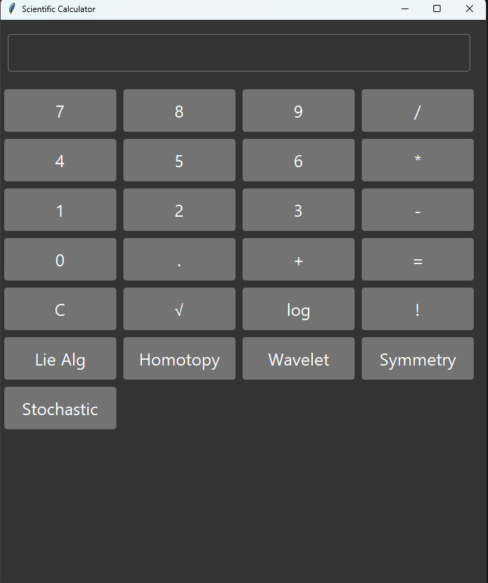

# Scientific Calculator

## Overview

This Python application is an advanced scientific calculator built using Tkinter, a standard GUI library for Python. The calculator supports a variety of mathematical operations, including basic arithmetic, factorials, square roots, logarithms, and advanced functions such as Lie algebra calculations, homotopy analysis, wavelet transforms, symmetry group analysis, and stochastic calculus.

The calculator uses the `azure.tcl` theme for a modern dark mode interface. Ensure that the `azure.tcl` file is in the same directory as the script or adjust the path accordingly.

## Features

- **Basic Arithmetic Operations**: Addition, subtraction, multiplication, and division.
- **Advanced Functions**: Factorial, square root, logarithm base 10.
- **Custom Functions**:
  - **Lie Algebra Calculator**: Computes the factorial of the evaluated result.
  - **Homotopy Analysis**: Computes the sine of the evaluated result.
  - **Wavelet Transform**: Computes the logarithm of the evaluated result.
  - **Symmetry Group Analysis**: Computes the cosine of the evaluated result.
  - **Stochastic Calculus**: Computes the exponential of the evaluated result.

## Installation

1. Ensure you have Python installed (Python 3.x is recommended).
2. Install Tkinter if not already installed. It usually comes with Python, but can be installed via your package manager if needed.
3. Download or create the `azure.tcl` theme file and place it in the same directory as the script.
* I also put the exe in the release, so you can download that too
## Usage


1. Run the script:
    ```bash
    python main.py
    ```
2. The application window will open with a dark-themed scientific calculator interface.

3. Use the numeric buttons and operations to perform calculations. 

4. The advanced function buttons provide additional mathematical operations.

## Code Details

### Main Components

- **`Tkinter`**: Used for the graphical user interface.
- **`ttk`**: Provides themed widgets with `azure.tcl` theme integration.
- **Mathematical Functions**: Utilizes functions from the `math` library for computations.

### Functions

- `add_to_display(text)`: Adds the given text to the calculator's display.
- `calculate()`: Evaluates the expression in the display and shows the result.
- `clear_display()`: Clears the calculator's display.
- `factorial_func()`: Computes the factorial of the input value.
- `sqrt_func()`: Computes the square root of the input value.
- `log_func()`: Computes the logarithm base 10 of the input value.
- `lie_algebra_calculator()`, `homotopy_analysis()`, `wavelet_transform()`, `symmetry_group_analysis()`, `stochastic_calculus()`: Perform specific advanced mathematical operations.

### User Interface

- **Display**: An `Entry` widget to show the current expression and results.
- **Buttons**: `ttk.Button` widgets for numeric inputs, operations, and advanced functions.

## Contributing

Contributions are welcome! Please feel free to submit issues, suggestions, or pull requests.

## License

This project is licensed under the MIT License - see the [LICENSE](LICENSE) file for details.

## Acknowledgements

- **Tkinter**: For providing the graphical user interface capabilities.
- **Azure Theme**: For the modern dark mode theme.

---

For any questions or issues, please contact the author or open an issue on the repository.
